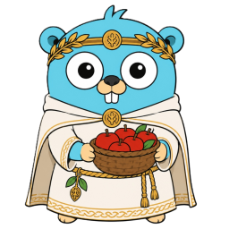

<div align="center">



# idunn

**Secure, headless-first software updates for Go.**
_Guarded by Algiz, renewed by Iðunn — built on Iðavöllr, the field where the gods rebuild._

[](https://pkg.go.dev/github.com/go-idavoll/idunn)
[](https://github.com/go-idavoll/idunn/actions/workflows/ci.yml)
[](LICENSE)
[](#status)
[](https://github.com/go-idavoll/idunn/actions/workflows/ci.yml)
[](https://github.com/go-idavoll/idunn/actions/workflows/redteam.yml)

</div>

---

## What is idunn?

**idunn** is a cryptographically secure installer and updater for Go applications.
It keeps software *forever fresh*: it pulls new releases from a remote repository,
verifies them end to end, and applies them atomically — with instant rollback if
anything goes wrong. It runs fully **headless** by default, with optional UI
sidecars per framework.

The trust core is not home-grown. idunn builds on **[The Update Framework
(TUF)](https://theupdateframework.io/)** via
**[go-tuf v2](https://github.com/theupdateframework/go-tuf)** for everything that is
easy to get subtly wrong — signatures, key management and rotation, freshness, and
rollback/freeze/mix-and-match defense. idunn owns the layer TUF deliberately leaves
open: **how to apply verified bytes** — atomic swap, migrations, elevation,
garbage collection, crash recovery, and UI.

> **Responsibility split:** go-tuf answers *"which bytes may I trust and fetch?"* —
> idunn answers *"how do I apply them safely?"*

## Features

_This is the designed scope, not a claim about today's code — see
[Status](#status) for what is implemented._

- **TUF-backed trust** (go-tuf v2): role separation, thresholds, key rotation
  without client redeploy, freeze/rollback/mix-and-match defense.
- **Headless-first**: no UI dependency in `core`; UI is opt-in via sidecars.
- **Atomic blue/green apply** with a launcher shim and versioned install dirs —
  **instant rollback** by repointing `current`.
- **Crash-safe transactions**: an `fsync` journal completes or rolls back an
  interrupted update on next start.
- **Migration hooks with rollback**: two host-provided hooks (`Migrate` +
  `Rollback`); migration logic never travels in a package.
- **Content-addressed delta updates**: unchanged assets are reused from the TUF
  cache or retained versions — only changed files cross the wire.
- **Privilege model**: per-user in-process, or a privileged system helper over
  authenticated IPC (privilege boundary == trust boundary).
- **Garbage collection** of old versions with a configurable retention window.
- **Reproducible, signed releases** maintained via `go:generate` and a TUF repo.
- **Auditable by design**: a written security concept (threat model + mitigations)
  and a 100% coverage goal for the lifecycle code.

## How it works

```
CheckForUpdate ─► TUF Refresh ─► MaterializeTargets (verified) ─► Stage
      │                                                             │
      └────────────── on error: abort, no changes ◄────────────────┘
                                                                    ▼
                                    Quiesce ─► Migrate ─► swap `current` ─► Commit
                                                     │           │
                                          on error ─┴─► Rollback + restore pointer
```

Every byte that lands on disk — reused, downloaded, or patched — is verified against
its TUF-signed target hash before commit. Trust is never weakened; delta only changes
*how* bytes are obtained, not *what* is trusted.

## Module layout

```
github.com/go-idavoll/idunn          # core library (this repo)
  core/trust      # go-tuf v2 wrapper: embedded root, Refresh, target resolve
  core/release    # release descriptor + channel pointer (TUF targets)
  core/fetch      # enterprise-aware go-tuf Fetcher (proxy/PAC, system CAs)
  core/stage      # verified staging + atomic apply + delta relink
  core/txn        # transaction journal, crash recovery, rollback
  core/hook       # Checker, Migrator, Observer, Prompter, Coordinator, Reporter
  core/updater    # Updater orchestration API
  core/installer  # first-time install orchestration
  core/elevate    # privileged apply (per-OS)
  core/fsx        # filesystem abstraction (interface + OS + in-memory)
  core/launch     # start-of-day: settle the journal, apply a deferred update
  core/timefloor  # monotonic known-good time floor (clock rollback defence)
  internal/safepath # the single validator for untrusted install-relative paths
  internal/delta    # the intra-file delta patch format (fuzzed apply path)
  internal/packer   # the publishing engine: pack.yaml -> signed TUF repository
  cmd/installer   # thin installer binary
  cmd/launcher    # the stable shim the install layout starts with
  cmd/packer      # go:generate TUF repo maintenance + build tool
  test/redteam    # standing adversarial corpus + harness (build tag: redteam)
  test/e2e        # the whole chain as real processes (build tag: e2e)
```

### UI sidecars

The `core` engine is UI-agnostic. UI lives in separate modules that implement the
optional `hook.Observer` / `hook.Prompter` interfaces — pick one at compile time:

- [`idunn-fyne`](https://github.com/go-idavoll/idunn-fyne) — Fyne GUI
- [`idunn-bubbletea`](https://github.com/go-idavoll/idunn-bubbletea) — terminal UI
- [`idunn-web`](https://github.com/go-idavoll/idunn-web) — WebView

## Usage (planned API)

> The API is not yet stable — see [Status](#status).

```go
fetcher, err := fetch.New(fetch.Options{UserAgent: "acme/1.0"}) // OS proxy + system CAs
if err != nil { /* ... */ }

trustClient, err := trust.New(trust.Options{
    Root:        embeddedRootJSON, // the shipped trust anchor, never downloaded
    MetadataURL: "https://updates.example.com/metadata/",
    TargetsURL:  "https://updates.example.com/targets/",
    LocalDir:    "/var/lib/acme/tuf",
    Fetcher:     fetcher,
})
if err != nil { /* ... */ }

u, err := updater.New(updater.Options{
    Trust:   trustClient,
    Fetcher: fetcher,
    Root:    "/opt/acme",
    Channel: "stable",
    Migrate: myMigrator,         // optional: Migrate + Rollback
    Observe: nil,                // headless; or wire a UI sidecar here
})
if err != nil { /* ... */ }

rel, err := u.CheckForUpdate(ctx)
if err == nil && rel != nil {
    err = u.Apply(ctx, rel)      // verify → stage → migrate → atomic swap → GC
}
```

## Security

idunn is **fail-closed**: any ambiguity aborts rather than proceeding "best effort".
The full threat model (T1–T23), design invariants, and residual risks live in
[`SECURITY.md`](SECURITY.md). Highlights:

- Trust anchor is an **embedded `root.json`**, never the update server.
- Packages carry **data only** — never executable update logic.
- The privileged helper **re-verifies** everything it installs; it never trusts a
  caller-supplied path or verdict.
- TLS-terminating corporate proxies (DPI) are tolerated **by design** — authenticity
  rests on TUF signatures, not on TLS.

> idunn is a design/trust *foundation*, not a proof of safety. The guarantee rests on
> the implementation, negative tests against tampered repositories, reproducible
> builds, and ideally an external audit.

## Naming & symbolism


Our mascot is the Go gopher as **Iðunn**, the Norse goddess who keeps the apples of
renewal — the same apples that keep your software fresh. The imagery is deliberate:

- **Apples of renewal** → the update itself (staying current).
- **Algiz (ᛉ)** — the protection rune on the headband and brooch → the **fail-closed
  trust** at the core.
- **Iðavöllr** — the field where the gods return to **rebuild** after Ragnarök →
  the org namespace `go-idavoll` (recovery & renewal).
- **The bridge & hall / the ravens** → the delivery channel and the recurring
  update check that flies out and reports back.

Guardian's shield plus the bridge between worlds — protection and delivery, in one
mark.

The mythology stops at the mark. Packages, types, error classes and target paths carry
functional names — `trust`, `fetch`, `stage`, `txn` — and always will
([`design.md`](docs/design.md) §2.1). A codename is charming in a README and a question
an auditor has to stop and ask in a stack trace.

## Status

**Early implementation.** The architecture and security concept are complete; the
code and public API are still taking shape and **may change without notice**. Not yet
suitable for production.

What exists today:

| Area | State |
|---|---|
| Descriptor & channel-pointer ingest (`core/release`, `internal/safepath`) | implemented, fuzzed, adversarially tested |
| TUF trust client and resolve (`core/trust`, `core/fetch`) | implemented, unit-tested and adversarially tested |
| Adversarial corpus (`test/redteam`) | 25 cases, gates every PR |
| End-to-end suite (`test/e2e`) | 11 scenarios over the real packer, installer, launcher and a host app, on all three platforms |
| Apply path: staging, journal, crash recovery, hooks, GC (`core/stage`, `core/txn`, `core/updater`, `core/installer`) | implemented, tested |
| Elevation (`core/elevate`) | interactive elevation on Windows (UAC) and Linux (pkexec); the privileged helper service runs on all three (Unix socket with peer credentials, named pipe with a security descriptor); the macOS prompt fails closed |
| Clock rollback defence (`core/timefloor`) | implemented: known-good time floor, checked before every refresh and apply |
| Delta stage 1 (content-addressed reuse) | go-tuf cache plus verified reuse of files already installed; relink (reflink/hardlink) open |
| Packer (`cmd/packer`, `internal/packer`) | publishes a delegated, reproducible TUF repository; `--retain N` retires old releases and the payloads only they named |
| Installer binary (`cmd/installer`) | implemented: embedded anchor, elevation decision, privileged `apply` verb |
| Launcher (`cmd/launcher`, `core/launch`) and `BusyDeferToRestart` | implemented: a busy application defers, the launcher applies at the next start and replaces itself when a release ships a new one |
| Delta stage 2 (binary patches) | implemented: `internal/delta`, patches emitted by the packer and found by convention, with the full target as the fallback |

The full section-by-section reconciliation against the design lives in
[`docs/status.md`](docs/status.md); the open work is tracked in
[`docs/backlog.md`](docs/backlog.md). Unimplemented functions carry their contract as
a doc comment and fail closed with a typed error — a loud placeholder rather than a
silent success.

## Contributing

Issues and discussion are welcome. Read [`AGENTS.md`](AGENTS.md) (the binding
contract, human or AI), [`CONTRIBUTING.md`](CONTRIBUTING.md), and
[`SECURITY.md`](SECURITY.md) before opening a pull request. For vulnerabilities, use
the private channel in `SECURITY.md` — never a public issue.

## License

Apache-2.0 — see [`LICENSE`](LICENSE). Every source file carries the header, and CI
enforces it (`make license`). By contributing you agree your work is licensed the same
way.